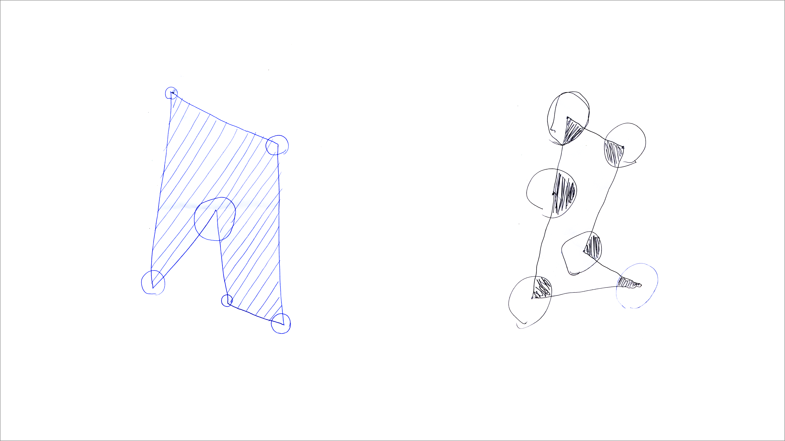
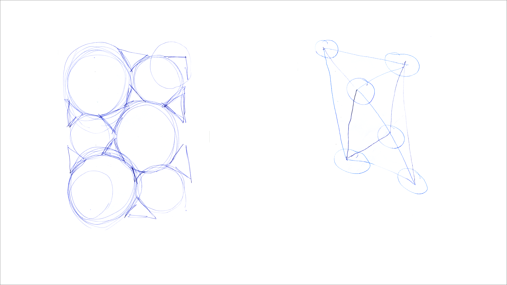
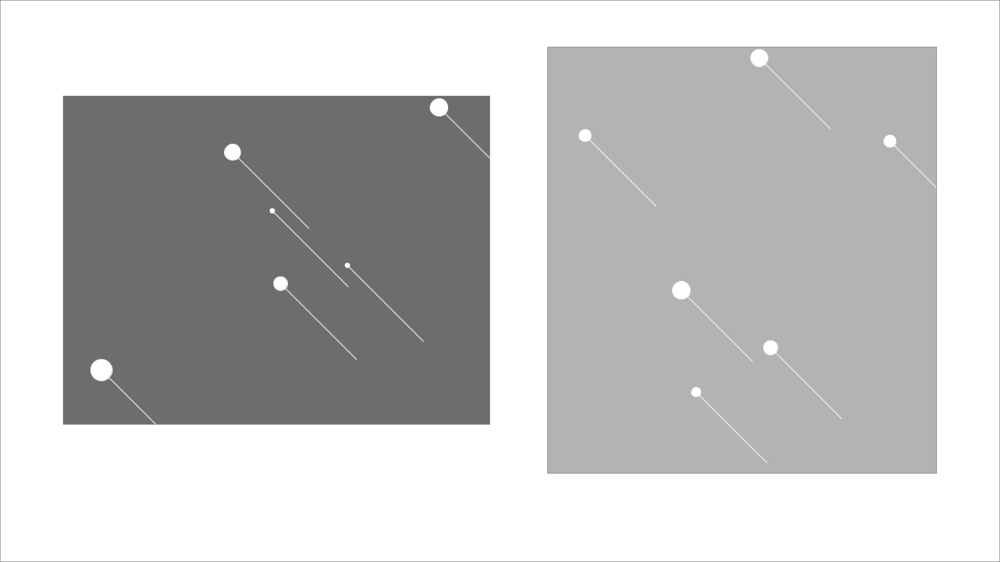

README
======

> "The beginning is always today."  
> [Mary Shelley](https://de.wikipedia.org/wiki/Mary_Shelley)

  

## Abstract of the algorythm project

Here are my final results of our first project developed during the summer term at FHP tutored by Fabian Morón Zirfas: 11EG-B Elementares Gestalten - Basics 1.012 Grundlagen Fläche und Struktur
Werkstattpraxis. [Link website](https://incom.org/workspace/5859)

## Prerequisite  

Our first challenge was to create a written instruction precise as much as possible, executed by ten different people, in order to generate an analog visual output. The participants were allowed to use all materials and formats we defined in the briefing. With these analog results the final goal was to create a processing program that translates our results into the digtal world.    

My first instructions (seen in the text below) gave these results.

*"Zeichne verteilt auf ein DIN A4 Blatt im Hochformat sechs Kreise. Durchmesser der Kreise mindestens kleiner Finger. Maximaler Durchmesser drei Finger. Der Abstand zur Blattkante soll mindestens daumenbreit sein. Die Kreise sollen weder horizontal nebeneinander noch senkrecht über- oder untereinander liegen, und sich weder überschneiden noch berühren (Mindestabstand der Kreise drei Finger). Verbinde mit einer Linie möglichst viele Kreise von deren Mittelpunkt aus so miteinander, dass sich keine Verbindungslinie überschneidet. Die jeweils entstandenen Vielecke sollen abwechselnd entweder mit parallelen Linien, Dreiecken oder sich berührende Kreisen maximal gefüllt werden."*

#### Here are the first run results

The first outcome were more inconsistent as I thought they would be, so we were asked to revise our text and start a new inquiry. Not only the text was more precise in its instruction this time but also had more detailed information and gave more opportunities on how to use different formats and materials. E.g. they could choose between different colors, paper types and formats.

#### Second, revised instruction

*"Benutze zum zeichnen Deine nicht dominante Hand und Kreiden.*

*Wähle ein rechteckiges Format und schneide dazu eine Seite des Papiers ab, jedoch nicht mehr als die Hälfte. Zeichne in diese Fläche sechs unterschiedlich große Kreise, die maximal drei Finger breit sind. Die Kreise dürfen nicht auf einer Geraden liegen, keinen Bogen beschreiben und sich nicht berühren. Mit geraden Linien verbindest Du möglichst viele Kreismittelpunkte, so dass sich keine Verbindungslinie überschneidet. Die jeweils entstandenen Vielecke sollen mit parallelen Linien, Dreiecken und sich berührenden Kreisen maximal gefüllt werden.*

Fortunately the second instruction was much more consistent in terms of the visual outcome.

#### So these are the final results   

## Dependencies  

In the next step we had to use Processing to translate our analog studies into a digital program using either:    

1. Java or
2. Python

Our tutor advised us to use python especially with regard to the following more Python focused projects. Although I had no experience neither with java nor with Python, I decided proceed with Python instead of using the more common and better web documented Java.

#### First code attempt

So my fist code experiments, written in Java, looked like these.

    void setup() {
      size(600, 600); //define canavas size
      background(255, 255, 255); //define canavas background: white  
      noFill(); //no filling
      smooth();
      }

    void draw() { //define draw
      drawEllipse(); //start function drawEllipse() six times
      drawEllipse();
      drawEllipse();
      drawEllipse();
      drawEllipse();
      drawEllipse();
      }

    void drawEllipse() { //define the functon drawEllipse
      strokeWeight(1); //define stroke weight
      stroke(0, 0, 0);  //define stroke color: black
      int x = int (random (100, 500)); //generate random integer x-value between 100 and 500
      int y = int (random (100, 500)); //generate random integer y-value between 100 and 500
      int width = int (random (5, 30)); //generate random integer width between 5 and 30
      ellipse(x, y, width, width); //define ellipse based on the upper random values x,y and width=height=circle

      if (frameCount > 0) { //call draw functonction only one time
      noLoop();
      }
      // Saves each frame as line-000001.png, line-000002.png, etc.
      saveFrame("line-######.png"); //create image in png format
      }

#### Visual results.

So I just created some random sized circles on a fixed canvas.

#### Second code attempt

With my second code I just tried to randomise the canvas size and background color and drew a line out of each circle center, pointing to the lower right side.

    void setup() {
      int X = int (random (400, 700)); //generate random integer x-value between 400px and 700px
      int Y = int (random (400, 700)); //generate random integer y-value between 400px and 700px
      size(X, Y); //creates a random background size within random X and Y
      int G = int(random(100, 200)); //defines an integer variable G with integer random values between 100 and 200
      background(G, G, G); // random greyish background color with the random value range between 100 and 200
      strokeWeight(1); //strock weight is 1 px
      stroke(255); //stroke color is white
      smooth(); // smoothes all schapes
      }

    void draw() { //defines the draw function
      int x = int (random (10, 500)); // creates X variable with random integer values between 10 and 500
      int y = int (random (10, 500)); // creates an Y variable with random integer values between 10 and 500
      int breite = int (random (5, 30)); // width defined as a integer random value between 5px and 30px
      ellipse(x, y, breite, breite); //defines a ellipese with random x, y and breite
      line(x, y, x+100, y+100); //this defines a line out of the circle center heading to the lower right

    if (frameCount > 5) { //stops to loop after fifth frame
      noLoop();
      }
      saveFrame("line-######.png"); //saves each frame as line-000001.png, line-000002.png, etc.
    }

#### Processing gave following results

Every now and then the random size canvas covered some circles, a problem which I couldn´t get rid of.

#### Final code
The final code was written in Python.

    from tri import Tri                                         #import external class data
    def setup():                                                #define the setup
    #noFill()                                                   ##nofilling
    size(600, 600)                                              #canvas size 600px by 600px

    tri1 = Tri(PVector(50,50),PVector(180,180),PVector(60,300)) #defines triangle one with three different PVector
    tri2 = Tri(tri1.p3,tri1.p2,PVector(350,350))                #defines triangle two
    tri3 = Tri(tri2.p3,tri2.p2,PVector(180,30))                 #defines triangle three
    tri4 = Tri(tri3.p3,PVector(400,100),tri3.p1)                #defines triangle four
    tri5 = Tri(tri3.p3,tri1.p1,tri1.p2)                         #defines triangle five

    tri6_inner = Tri(tri4.p2,tri4.calc_mid3(),tri3.p1)          #defines the inner triangle of triangle 4 through: point 2, the mid between point 1 and point 3 and the final point 1
    tri7_inner = Tri(tri1.p1,tri1.calc_mid2(),tri1.calc_mid1()) #defines the inner triangle of triangle 1 through: point 2, the mid between point 3 and point 3 the mid between point 2 and point 2
    tri8_inner = Tri(tri1.p1,tri1.calc_mid3(),tri1.calc_mid2()) #efines the inner triangle of triangle 1 through: point 2, the mid between point 3 and point 3 the mid between point 2 and point 2

    tri1.draw_triangle(250,0,0)                                 #draws triangle one: calls draw_triangle function with R,G,B filling and coordinate of tri1 (triangle one)
    tri2.draw_triangle(255,234,0)                               #draws triangle two: calls draw_triangle function with R,G,B filling and coordinate of tri2 (triangle two)
    tri3.draw_triangle(86,236,164)                              #draws triangle three: calls draw_triangle function with R,G,B filling and coordinate of tri3 (triangle three)
    tri4.draw_triangle(250,250,250)                             #draws triangle four: calls draw_triangle function with R,G,B filling and coordinate of tri4 (triangle four)
    tri5.draw_triangle(141,130,248)                             #draws triangle five: calls draw_triangle function with R,G,B filling and coordinate of tri5 (triangle five)

    tri6_inner.draw_triangle(123,44,45)                         #draws inner triangle one through draw_triangle function with R,G,B filling
    tri7_inner.draw_triangle(13,55,110)                         #draws inner triangle two through draw_triangle function with R,G,B filling
    tri8_inner.draw_triangle(186,19,123)                        #draws inner triangle three through draw_triangle function with R,G,B filling

    tri1.display_ellipse()                                      #draws ellipses of triangle one through dsiplay ellipse function
    #tri2.display_ellipse(255)
    #tri3.display_ellipse(255)
    tri4.display_ellipse()                                      #draws ellipses of triangle four through dsiplay ellipse function
    #tri5.display_ellipse(255)

    saveFrame()                                                 #Save Frame function as tiff

    # executed once
    #def draw():
    # executed all the time

    #circle packing processing
    #parralel lines

#### Outsourced class data

    class Tri(object):                #declerates the class named Tri     
    p1 = PVector(0,0)             #defining seven Pvector with coordinates (0/0)
    p2 = PVector(0,0)
    p3 = PVector(0,0)
    p4 = PVector(0,0)
    p5 = PVector(0,0)
    p6 = PVector(0,0)
    p7 = PVector(0,0)

    w_p1 = int(random(10,50))          #defines randomized width for ellipse on point 1 between 10 and 50
    h_p1 = w_p1                        #defines height equals width for ellipse on point 1

    w_p2 = int(random(10,50))          #defines randomized width for ellipse on point 1 between 10 and 50
    h_p2 = w_p2                        #defines height equals width for ellipse on point 1

    w_p3 = int(random(10,50))          #defines randomized width for ellipse on point 1 between 10 and 50
    h_p3 = w_p3                        #defines height equals width for ellipse on point 1

    def __init__(self, point1, point2, point3): #Dont get what this is doing
        self.p1 = point1                  #constructor
        self.p2 = point2
        self.p3 = point3                               

    def draw_triangle(self, R,G,B):     #method of class display, defines the draw triangle function
        fill(R,G,B)                     #filling values with handover R,G,B
        beginShape()                    #intilialises the shape
        vertex(self.p1.x,self.p1.y)     #creates a vertex with point one x values and point one y values
        vertex(self.p2.x,self.p2.y)     #creates a vertex with point two x values and point two y values
        vertex(self.p3.x,self.p3.y)     #creates a vertex with point three x values and point three y values
        endShape(CLOSE)                 #closes shape

    def display_ellipse(self):                                    #method of class display. defines the ellipse function to draw ellipse. Handover R,G,B values deactivaded (self, R,G,B)
        noFill()                                                  #plain circles no filling only stroke line
        #fill(R,G,B)                                              #fill(R,G,B)
        ellipse(self.p1.x, self.p1.y, self.w_p1, self.h_p1)       #creates the ellipse with center point one x and y values and random height and width see beginning
        ellipse(self.p2.x, self.p2.y, self.w_p2, self.h_p2)       #creates the ellipse with center point two x and y values and random height and width see beginning
        ellipse(self.p3.x, self.p3.y, self.w_p3, self.h_p3)       #creates the ellipse with center point three x and y values and random height and width see beginning

    def calc_mid1(self):                                          #defines the function to calculate the mid between two vectors in an triangle. Here the center between point one and two
        xmid = (self.p1.x + self.p2.x) / 2
        ymid = (self.p1.y + self.p2.y) / 2        
        return PVector(xmid, ymid)                                #so we have a new point             

    def calc_mid2(self):                                          #defines the function to calculate the mid between two vectors in an triangle. Here the center between point two and three
        xmid = (self.p2.x + self.p3.x) / 2
        ymid = (self.p2.y + self.p3.y) / 2        
        return PVector(xmid, ymid)                                #so we have a new point

    def calc_mid3(self):                                          #defines the function to calculate the mid between two vectors in an triangle. Here the center between point three and one
        xmid = (self.p3.x + self.p1.x) / 2
        ymid = (self.p3.y + self.p1.y) / 2        
        return PVector(xmid, ymid)                                #so we have a new point

#### Result final code

   

I was happy that I did it this far. Bringing in the parallel lines and densely packed circles into the triangles was the last step I couldn´t manage to realize.   

#### Transform pattern into an application

As a subtask we were asked to create a certain application for our visual output. On the one side the developed pattern reminded me of church windows, with its fractal structure. On the other side I thought that this pattern could also work as a modern spatula.

#### Church window and spatula

## Installation  

For installation simply download the file on your hard
disk. [Link to code](https://github.com/back280/IO-SoSe-2015-algorithm/tree/master/code/sketch_150921_final)

## Usage  

Open the data in processing by double click it and press the run button.  

## Thanks  

I want to thank Fabian Morón Zirfas for all the support.

## License  

    DO WHAT THE FUCK YOU WANT TO PUBLIC LICENSE
    Version 2, December 2004

    Copyright (C) 2015 Paul Roemer

    Everyone is permitted to copy and distribute verbatim or modified
    copies of this license document, and changing it is allowed as long
    as the name is changed.

    DO WHAT THE FUCK YOU WANT TO PUBLIC LICENSE
    TERMS AND CONDITIONS FOR COPYING, DISTRIBUTION AND MODIFICATION

    0. You just DO WHAT THE FUCK YOU WANT TO.
